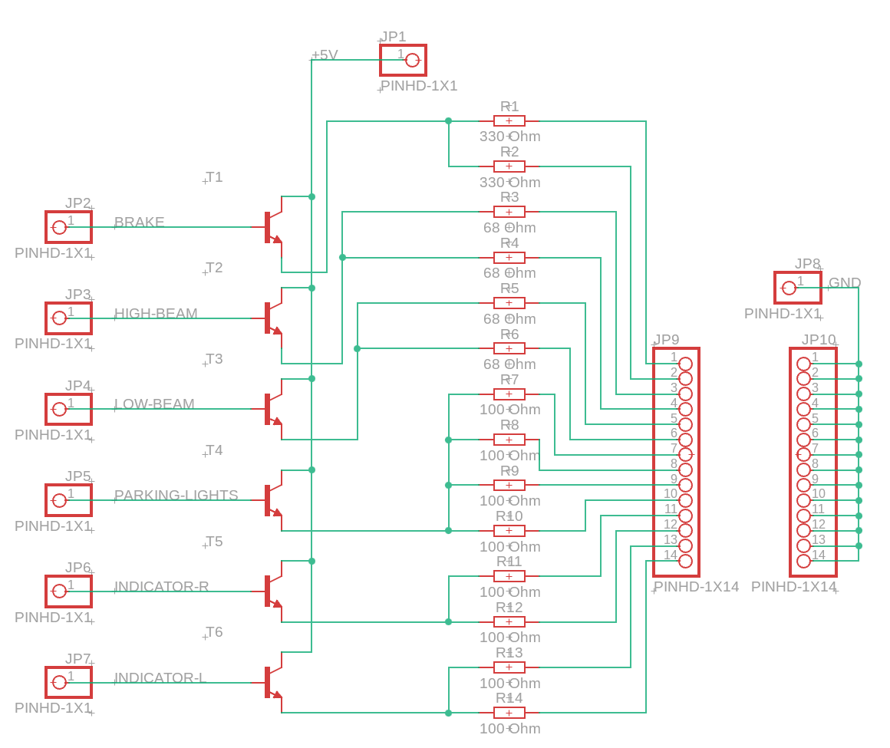

# Hardware documentation - Teleoperated Driving Project
This is the documentation for the hardware components on the Teleoperated Driving Project by TU Ilmenau.

## Table of contents
- [Hardware documentation - Teleoperated Driving Project](#hardware-documentation---teleoperated-driving-project)
  - [Table of contents](#table-of-contents)
  - [Overview](#overview)
  - [Arduino Pin configuration](#arduino-pin-configuration)
  - [Human Machine Interface Mapping](#human-machine-interface-mapping)
  - [LED Board](#led-board)

## Overview
In this documentation, the hardware configuaration and overall construction of the electronics and microcontrollers is documented. The whole Project is divided into several components. A Raspberry Pi as the controller for almost everything, two Arduino Nanos for controlling the indicators flashing and the horns frequency. A power delivery board handles all the 5V power needs. This power delivery board is connected to a 5V DC/DC Converter. A second 5V DC/DC Converter handles the power demand of the Raspberry Pi. For controlling the LEDs a LED Driver Board is implemented. This board consists of 6 NPN Bipolartransistors and the Resistors for the LEDs. Additionally it features a 5V and GND connection to power the LEDs. The complete structure is seen in the following diagram:

The 6.5V DC/DC Converter is used as a stable Reference Voltage, that features a high Power Output. If necessary the Steering Servo can be connected to the 6.5V DC/DC Converter, this should make the Servo respond faster.

## Arduino Pin configuration
The pin configuration for the Raspberry Pi is as following:

The fan of the Raspberry Pi is connected to the power delivery board. The IMU, Arduinos, Buzzer, Servos and Lights are controlled by the Raspberry Pi. The Webcam is connected via USB. The Lidar sensor is also connected via USB and a serial adapter.

## Human Machine Interface Mapping
The Fanatec Steering Wheel is read by a selfmade driver. In order to change the button mappings, it is neccessary to know the buttons on the steering wheel. In the following diagram, all buttons on the steering wheel are listed:

## LED Board
The LED Board handles the LED actuation, by receiving a signal from the Raspberry Pi and the Arduino. This signal turns the corresponding NPN Transistor on and therefore the LED. The LED Board also features resistors for the corresponding LEDs.

